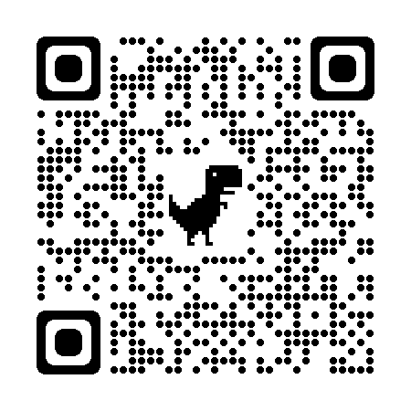

## Projeto de portfolio simples
### Sobre:
Projeto desenvolvido seguindo os cursos de HTML e CSS da Alura, apenas para aprendizado, usando conceitos básicos.

### Linguagens usadas:

  
  

### QR Code e Imagens:

  Leia o QRCode para ir direto ao site:

   

 

  Imagens do Projeto:
  

    
    
  

  
### Contato:

Email: igordsrosaa@outlook.com 
Telefone: (11)968326487

          

